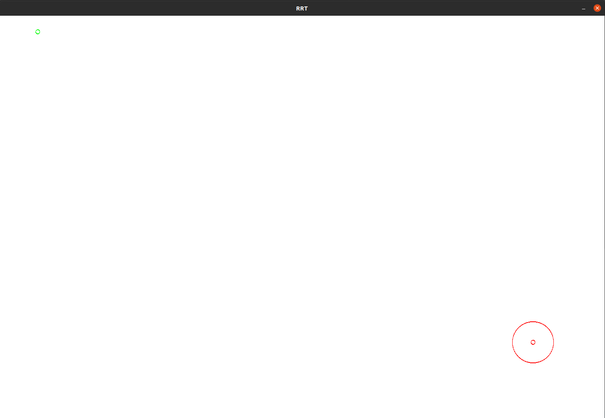

# RRT
Rapidly Exploring Random Tree in C++


# Running on Linux
1. required libsdl2-dev : if you don't have it. Then you can install it using
   
   ```sudo apt-get install libsdl2-dev```
2. after cloning the repo. Run the following commands
```
mkdir build
cd build
cmake ..
make
```

3. Then to run it 
```
./RRT
```
# Instructions to run.
1. The terminal will ask you what dimensions you want your canvas to be.
   I have a 15 inch laptop so I choose width = 1000 and height = 1000 

2. A gui with a blank white canvas will turn up.
   Select the starting position by left clicking on the screen. 
   A green circle will come up.

    
3. Left click somewhere else on the screen and left click again on the screen. A red circle will come up 
   

4. Left click again close to the end point to get a region around the circle , which would imply that the solution has been reached.
    

5. Left click again anywhere on the screen to get a starting and ending point. These points represent the maximum distance travelled in any direction.

    

6. Obstacles can only be in the form of rectangles. So to create obstacles.
   To create  a rectangle, select the two opposite corners of the rectangle. top left and bottom right or bottom left and top right. In that order.

   

7. Then close the window.
8. The terminal will ask you how many iterations you want to execute. pick any number. 
9.  It'll evaluate that many times and then pop up an other image with the solution.
10. You can keep adding number of iterations until your solution is found.


11. Since RRT is not inherently designed to optimize it's path to the shortest path once the solution is found. The program stops once the solution is found.

